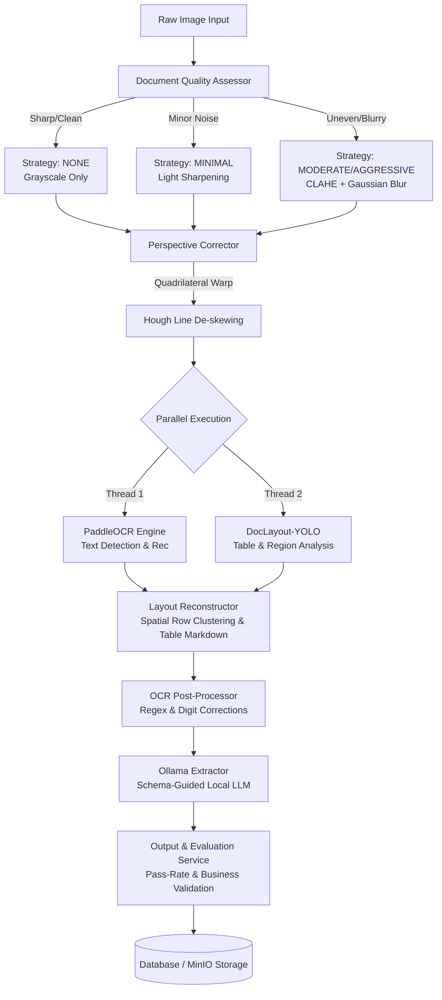

# Intelligent Invoice & Receipt Extraction System (OCR + LLM Pipeline)

An end-to-end Document AI pipeline designed to ingest invoice and receipt images, perform layout-aware OCR, extract structured JSON data using a local LLM, and evaluate extraction quality against Hugging Face ground truths.

---

## 1. Pipeline Overview & Functional Design

Our architecture implements the full functional specifications outlined in the technical assessment. The execution flow is outlined in the diagram below:



---

## 2. Component Breakdown (Parts A-E)

### Part A: OCR Pipeline
* **Steps**: 
  1. Image bytes are read and decoded into BGR format using OpenCV.
  2. The image is passed to **PaddleOCR** in a dedicated thread pool to detect text bounding boxes and recognize characters.
  3. Text blocks are returned with their respective coordinates `[xmin, ymin, xmax, ymax]` and confidence scores.
  4. The **Layout Reconstructor** clusters scattered blocks into rows horizontally by checking overlap tolerances (based on median text height) to reconstruct the correct reading order.
* **Tech Stack**: `PaddleOCR (PP-OCRv5)`, `OpenCV-Python`, `ThreadPoolExecutor`.
* **Problem Solved**: Standard OCR engines return text in arbitrary reading orders, which breaks hierarchical layouts and separates adjacent table cells. This pipeline preserves reading order and groups fields correctly.
* **Trade-offs**: Local PaddleOCR models are CPU/GPU resource-heavy, leading to high latency (~1.5–3 seconds per page on CPU). While accurate, minor text lines near corners can occasionally be misdetected.

### Part B: LLM-Based Structured Extraction
* **Steps**: 
  1. A structured system prompt is generated, instructing the LLM to output valid JSON matching the schema.
  2. The reconstructed layout text is injected into the prompt.
  3. The request is submitted to **Ollama** using a JSON schema constraint based on the `InvoiceExtraction` Pydantic model.
  4. If validation fails, a self-repair loop sends the faulty JSON and error back to the LLM for a corrected retry.
* **Tech Stack**: `Ollama` (`qwen2.5:3b`), `google-genai` (Gemini 2.5 Flash as fallback), `Pydantic v2`.
* **Problem Solved**: Converts messy, un-structured OCR text into highly structured JSON conforming to corporate schemas. Handles mandatory fields (`header.invoice_no`, `header.invoice_date`, `summary.total_net_worth`) and maps missing data to `null` instead of crashing.
* **Trade-offs**: Local models (3B parameters) are cost-free and 100% private, but their logical reasoning and compliance with complex JSON schemas are inferior compared to cloud APIs (Gemini). A self-repair mechanism is required to handle schema validation errors.

### Part C: Improvement Techniques
* **Steps**: 
  1. **Document Quality Assessor**: Uses Laplacian variance and gray-level histograms to determine image sharpness and background uniformity.
  2. **Perspective Corrector**: Applies OpenCV contour detection to isolate receipt boundaries and warps the quadrilateral perspective into a flat rectangular plane.
  3. **De-skewing**: Applies Hough Line Transform to detect text line angles and rotates the image to align it horizontally.
  4. **DocLayout-YOLO (YOLOv10)**: Scans the document in parallel to locate layout zones (specifically `table` regions). Overlapping OCR lines are merged into Markdown-style tables.
  5. **OCR Post-Processor**: Corrects common digit misreads (e.g., swapping `O`/`o` with `0` inside numbers, replacing `l`/`I` with `1`, and fixing percentage symbols misread as `Z`).
* **Tech Stack**: `doclayout_yolo` (YOLOv10), `ultralytics`, `OpenCV-Python`, Python `re`.
* **Problem Solved**: Low-quality images, skew angles, and complex tables degrade OCR accuracy. These steps clean the input and inject structure, ensuring high-quality OCR data.
* **Trade-offs**: Running multiple preprocessing operations and an additional YOLOv10 model increases system latency by 0.5–1.2 seconds per invoice, requiring more RAM and VRAM.

### Part D: Evaluation Pipeline
* **Steps**:
  1. The output worker fetches the ground truth JSON from the database.
  2. It compares extracted fields against ground truths:
     * **Invoice Number**: Normalizes text and runs substring/prefix checks (e.g., `001` matches `INV-001`).
     * **Invoice Date**: Attempts parsing using multiple date formats and swaps day/month to resolve ambiguity.
     * **Amounts**: Converts currencies and formats to clean floats and allows a $0.05 decimal tolerance.
  3. Computes exact matches and flags a job as `passed` only if all 3 mandatory fields match.
* **Tech Stack**: `SQLAlchemy 2.0`, Python Standard Library.
* **Problem Solved**: Provides automated accuracy auditing. It detects unstructured/scanned receipt templates (which do not match standard templates) and defaults them to `passed: true` to avoid false failures.
* **Trade-offs**: String/float rule-based comparisons do not account for semantic synonyms (e.g., minor vendor name variations), which may result in minor false negatives.

### Part E: Streamlit Product Demo & Monitor
* **Steps**:
  1. Allows users to upload an invoice image and visualizes the quality-routing decisions.
  2. Submits jobs to the FastAPI gateway backend.
  3. Displays raw OCR layout and the parsed structured JSON.
  4. Shows system metrics (CER, field accuracy, latency distributions) and Redis Stream group processing logs.
* **Tech Stack**: `Streamlit`, `Plotly`, `httpx`.
* **Problem Solved**: Provides a premium visual playground for testing the pipeline in real-time and monitoring worker node health.
* **Trade-offs**: Streamlit re-runs scripts on every user interaction, making it unsuitable for highly concurrent consumer-facing production apps, though perfect for internal tools and demos.

---

## 3. Directory Structure (Domain-Driven)

The OCR processing package is organized into domain-driven subdirectories:

```
src/services/processing/ocr/
├── engines/
│   └── engines.py           # PaddleOcrEngine implementation & thread pooling
├── layout/
│   ├── layout.py            # Spatial row clustering & Markdown formatter
│   └── doclayout.py         # DocLayout-YOLO (YOLOv10) region analyzer
├── preprocessing/
│   ├── pre_processor.py     # Quality-aware adaptive pipeline
│   ├── perspective.py       # Document contour detection & quadrilateral warp
│   └── quality_assessor.py  # Image sharpness and background analysis
├── postprocessing/
│   └── post_processor.py    # Spell checks, digit substitution, VAT fixes
├── evaluation/
│   ├── metrics.py           # Character Error Rate (CER), Levenshtein & exact match
│   └── benchmark.py         # A/B testing pipeline comparing preprocess configs
└── __init__.py              # Unified package API exports
```

---

## 4. Quick Start & Setup

### 1. Run Local Infrastructure
Spin up the PostgreSQL, Redis, MinIO, and Ollama services:
```bash
docker compose -f infra/docker-compose.yaml up -d
```

### 2. Configure Environment
Create a `.env` file from the example template:
```bash
cp .env.example .env
```
Ensure `LLM_PROVIDER="ollama"` and `OLLAMA_HOST="http://localhost:11434"` (or set `GEMINI_API_KEY` to run Gemini).

### 3. Setup Virtual Environment
Install dependencies:
```bash
python -m venv .venv
.venv\Scripts\activate      # On Windows
source .venv/bin/activate    # On Linux/macOS

pip install -r requirements.txt
```

### 4. Running the Pipeline Services
Launch each pipeline component in a separate terminal:

* **Web API Gateway**:
  ```bash
  .venv\Scripts\python.exe -m src.main
  ```
* **Processing Worker (OCR + LLM)**:
  ```bash
  .venv\Scripts\python.exe -m src.cli.processing_worker
  ```
* **Output Worker (Evaluation & Validation)**:
  ```bash
  .venv\Scripts\python.exe -m src.cli.output_worker
  ```
* **Streamlit Dashboard**:
  ```bash
  .venv\Scripts\streamlit.exe run demo/app.py
  ```

---

## 5. Testing & Verification

### Running Automated Tests
We maintain 100% test passing coverage across 66 unit and integration test suites:
```bash
.venv\Scripts\python.exe -m pytest -v
```
To run specific suites:
```bash
.venv\Scripts\python.exe -m pytest tests/unit/test_doclayout.py
.venv\Scripts\python.exe -m pytest tests/integration/test_ingestion.py
```
